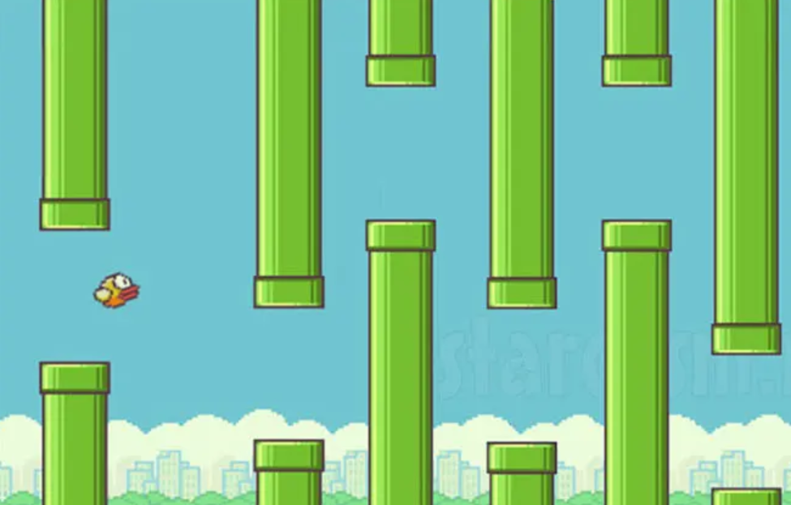
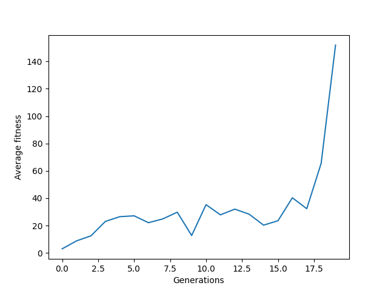
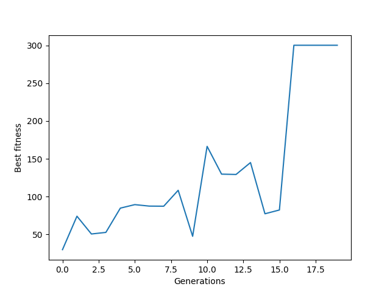

# Evolution AI for Flappy bird
### Project in "Topics in appliction of computer science".
### by: Tom or, Noa Cohen , Yonatan Hod

## Intoduction

"Flappy bird" is an arcade styled game popularized in the 2010's built for mobile phones.
#### Gameplay:
The player play as the bird, while the goal of the game is to dodge some pipes 
by "jumping" and getting far as one can. The pipes position varies in the game. The score increase by 1 every time the bird 
successfully passes through a pipe.

###### Figure 1. Gameplay. When the bird touches a pipe, the player loses ,and the game is over.

## Problem Description
We wanted to develop an algorithm which will play the game. That is, giving
the game settings (pipes position, bird position), the algorithm will decide when to "jump"
and getting as far as can.  
Developing an algorithm using ordinary methods (i.e not learning) can be quite difficult:
defining the rule when to jump may require a large amount of trial and error and maybe some knowledge of the
game physics. 
Therefore, we show to power of genetic programming which will learn to play the game. 

More specifically, we will use a simple neural network to decide when to jump. Usually,
neural networks are optimized through back-propagation, but for our problem setting
it is not suitable, as we don't have "train data". We will demonstrate
how we can "optimize" it through GP (that is, finding good parameters for our network).

Overall, the problem is to search a set  `P` of parameters for a specific neural network architecture `N`,
so `N` given the settings of `P` will allow the bird to get as far as possibly.

## Solution through GP

For the usage of GP we need to represent an individual,
fitness method and genetic operators.

### Individual
Our individual is the bird, with the property of a neural network `model`.
### Fitness
We evaluate a fitness of an individual by simulating the game with that individual:  
For every 30ms that the individual still has not lost, we increased the fitness by 0.05.  
For every pair of pipes that the individual passed,we increased the fitness by 1.5 . 
#### Notes:
If the individual left the frame of the game (jump too many times, or didn't jump at all) we count it as loss.
We added a "penalty" of 1 to the fitness value when the individual lost. we saw it gave better results.  
The individual decides to jump or not every 30ms.

### `model`
`model` is a simple feed-forward neural network with 3 input nodes, and 1 output node - a total of 3 weights and 1 bias parameters to find.
We used tanh activation function (so the result is between [-1,1]) and if `model` output was higher than 0, the bird jumped. 
We fed the model the (current) height of the individual,the distance from the top pipe, and the distance from the bottom pipe.

### Encoding
We encode an individual through the parameters of his `model` .

### Population
The initialized population is a group of birds, each one has random parameters for `model` sampled
from distribution `D`.

### Genetic Operators
We defined 2 genetic operates: `ModelAddDistMutation` , `ModelParamSwapCrossOver`.

#### `ModelAddDistMutation`:
`ModelAddDistMutation` is a mutation operator. It takes the encoding of an individual, i.e the parameters
of `model`, and adds to each parameter random value sampled from `D`.

#### `ModelParamSwapCrossOver`:
`ModelAddDistMutation` is a cross-over operator. It takes the encodings of  2 individuals: `A`,`B`, and create new encoding `C` the following way: 
For each new parameter `k` , with probability of `p1`, take the corresponding parameter `k'` of `A` and set `k=k'`, otherwise, take from `B` (we set `p1`=0.5).
 .Then, with probability of `p2` swap `A` with `C`, otherwise swap with `B` (we set `p2`=0.5).

### Selection method
We used Tournament Selection of size 3.

## Software Overview:

+ `pygame` package was used to implement the game logic (collision,drawing etc...).
+ `eckity` for implementing GP logic.
+ `pytorch` for the neural network logic.

### Bird

`Bird` is a class which represents individual. Therefore, it is  inheriting
from `eckity.individual.Individual` class.  Main Methods:  
+ `jump`: jumping behavior
+ `move`: moving behavior  
+ `get_mask`: return the masking of the bird. Used to check collision
+ `draw`: draw the bird.
+ `excute`: this method is called at the end of the program on the best individual. its show a simulation of the individual playing.

#### Notes
The images needed to display the bird are not a property of the `Bird` class. This is 
because there is a serialization problem when they are.

### Pipe, Base 
Pipe and Base are 2 classes which represent the pipes, and the base (the floor and the background) of 
the game.
The Pipe class implements  `collision` method. this method take as a parameter a Bird instance, and checks
if collision happened.

#### Notes:
Pipe and Base implements `move`, so in the screen they will show as moving.

### BirdEvaluator
Evaluator class for individual.( inheriting from `eckity.evaluators.simple_individual_evaluator.SimpleIndividualEvaluator`)
The class main method is `_evaluate_individual` which evaluates an individual:
simulates a game given the individual.

#### Notes:
`_evaluate_individual` uses a helper method `eval` which preform the simulation logic.
`eval` takes as flag `show_game` which indicates whether to display the gameplay.
In this context it is passed as `False` , to help faster computation.
`eval` also takes `limit` parameter which terminates the game if the individual passed
with his fitness `limit` value.

### FFmodel
This class implements `model` property of individual. It's inheriting from `torch.nn.Module`.
An instance of the class is `model` neural network described above. The parameters of the model
are initialized as follows: setting `stdv = 1. / math.sqrt(3)` (3 is the size of the weights).
Then the distribution `D` is `uniform(-stdv,stdv)`

### BirdCreator
This class implements how individuals are made (inheriting from `eckity.creators.creator.Creator`). The class main method is `_create_individuals`.
We create `n` individual by creating `n` `Bird` instances.

## Experiments and Results

For all the experiment, we used the following setting:

`eckity.algorithms.simple_evolution.SimpleEvolution` object as our handler for evolution process. 
Only one subpopulation (generated from `BirdCreator`) with `elitism_rate` = `1/300` , and for our genetic operators we used
probability `0.1` for both. We used `TournamentSelction` with size of 3.  
The difference between our experiment was the initial population size, and the number of generation.

The following is an example of individual from the first generation. We see their movment is random, and they dont get far.

https://user-images.githubusercontent.com/81587688/211167129-0a09fcf4-117a-42d0-82a9-94f6f2766d0e.mp4

We observed that initial large population size lead to quick convergence:
even in the first generation there was an individual that got far and preformed well: 

https://user-images.githubusercontent.com/81587688/211167140-0715b53d-8e75-4753-9978-34f18dc5685d.mp4
###### An individual from population size of 400 from the first generation. Got to fitness  limit, 300(video is trimmed).

So in order to not make our experiment not dull, and actually observing progress between generations, we decided to use
small population size.  

#### Population of 80

Even for population of size 80, we got fast convergence rate:

https://user-images.githubusercontent.com/81587688/211170457-4cf8b6f7-3467-4307-b43d-a6ef9a7e19df.mp4

###### The Best individual in generation 5. Notice the score value.

#### Population of 20

The most insightful results was for population of size 20.
Even with small starting fitness for the initial population, after 20 (and even less) generations,
there were individuals with maximum fitness.

#### After 10 generations, reached score of 4 (managed to pass 4 pipes).
https://user-images.githubusercontent.com/81587688/211167126-506aeee1-c7b5-4375-b6c4-f73cf596f67b.mp4

#### After 20 generations, reached maximal fitness (video  is cropped)
https://user-images.githubusercontent.com/81587688/211167128-0a11894d-1a5a-48ae-a31a-7d4310a12369.mp4

##### Stats and plots for 20 sized population:

###### Figure 2. Average fitness by generation

###### Figure 3. Best fitness by generation

## Conclusion

We demonstrate how to create a genetic algorithm to play "Flappy Bird". From our results, it is
possible that the problem is "easy" for a genetic algorithm: we struggled to find a setting where the problem
wasn't solve quickly. Even in some trials for the 20 sized population experiment, 2-3 generation was enough.  
This phenomenon probably happen because our search space isn't too big: we needed to find suitable 4 parameters
for a simple feed forward network,so it was likely that even in the initial population a suitable individual exist.  
However, even when the best individual in the initialed population had low-fitness  (such in `Figure 3`) our algorithm succeeded.  

An interesting point to continue research about is our genetic operators. We defined and choose those operators
(`ModelAddDistMutation` , `ModelParamSwapCrossOver`) by intuition, and didn't prove any theoretical reasoning.
We didn't find any go-to solution for defining genetic operators, but even for those "random" operators, good results are achieved,
so with more thought and research, maybe a general approach for those kind of problems can be derived, and great results
can be achieved for harder problems.  

Overall , it was interesting to see how complex problem can be solved "easily" by a genetic program and we think genetic algorithms are powerful tool to optimize neural networks, and in some cases, they are better than
the normal approaches, such as back-propagation.  

